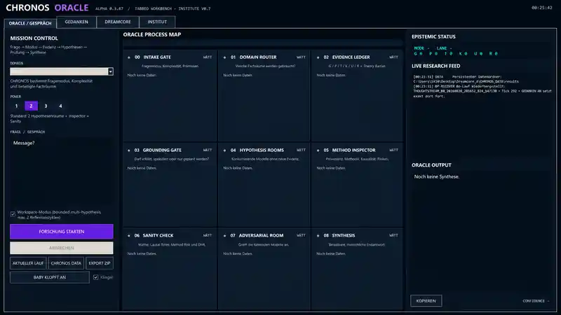
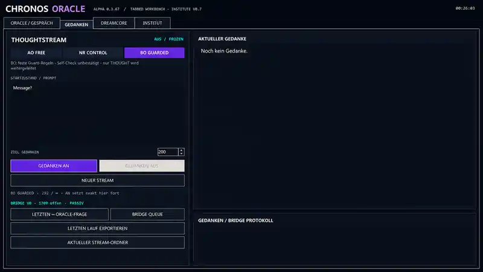
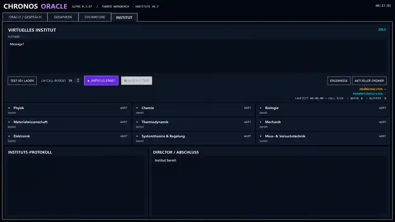
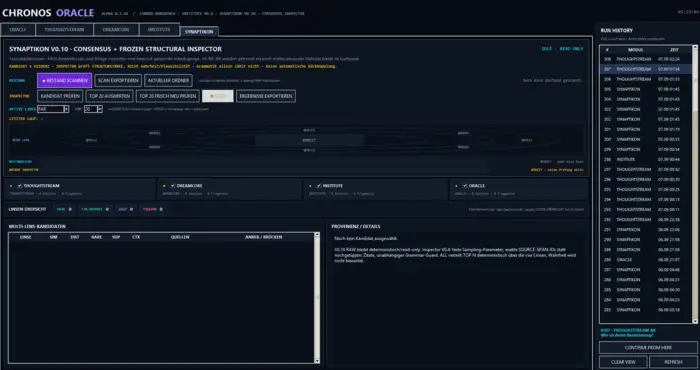

# CHRONOS ORACLE — Research Showcase

> **Public research showcase only. The CHRONOS source code is not included in this repository.**

CHRONOS ORACLE is an experimental research workbench developed under the **NOVA DREAMCORE** project.

The current documented application checkpoint is:

- **CHRONOS ORACLE:** Alpha **0.3.85**
- **DreamCore:** **0.6.1**
- **Institute:** **V0.7**
- **Application type:** integrated desktop research workbench
- **Source release:** **not public**

The current workbench combines five research surfaces plus workflow history:

`ORACLE / GESPRÄCH | GEDANKEN | DREAMCORE | INSTITUT | SYNAPTIKON | RUN HISTORY`

## Interface

### ORACLE / GESPRÄCH

### GEDANKEN / ThoughtStream

### DREAMCORE

### INSTITUT

### SYNAPTIKON

> DreamCore and Synaptikon now show the Alpha 0.3.85 interface generation, including the current Run History surface. Some other public screenshots may still reflect an earlier capture set.

## What CHRONOS is trying to do

CHRONOS is designed to work with **competing hypotheses rather than a single unchecked answer**.

At a high level, a research question can move through stages such as:

`QUESTION → INTAKE → ROUTER → EVIDENCE → HYPOTHESES → INSPECTOR → SANITY → ADVERSARY → REFLECTION → SYNTHESIS → FINAL AUDIT`

The goal is not to make a language model sound more certain. The goal is to make disagreement, uncertainty, provenance, criticism and unresolved failure states more visible.

## Current research surfaces

### ORACLE / GESPRÄCH
Bounded multi-hypothesis research workflow with review, adversarial checking, synthesis and audit stages.

### GEDANKEN / ThoughtStream
Recursive artificial thought-stream experiments.

Current experimental modes include:

- **A0 FREE** — recursive free stream
- **NR CONTROL** — non-recursive control; the original prompt is supplied on every tick and the previous generated thought is not used as the next input
- **B0 GUARDED** — guarded experimental stream

The September 2026 exploratory series produced a set of deliberately strange but useful examples in which a recurrent stream remained locally coherent while drifting away from the original task. Public examples include repeated `42` number choices, Tic-Tac-Toe turning into football tactics or UI design, telephone-game prompts turning into vibration sensing or photovoltaics, counting turning into symbolic/code narratives, and synthetic first-person scene construction.

See:

- [`protocols/04_THOUGHTSTREAM_ATTRACTOR_EXAMPLES.md`](protocols/04_THOUGHTSTREAM_ATTRACTOR_EXAMPLES.md) — compact interpretation / trajectory summary
- [`protocols/05_THOUGHTSTREAM_VERBATIM_EXCERPTS.md`](protocols/05_THOUGHTSTREAM_VERBATIM_EXCERPTS.md) — selected exact output excerpts from the original exported streams

### DREAMCORE
Offline recombination / dream-cycle experiments. Internally generated material is kept separate from observed evidence and is not promoted to fact merely because the system generated it.

### INSTITUT
Higher-cost structured review layer for selected findings, including role-aware checking and deterministic math/unit checks.

### SYNAPTIKON
Cross-link / inspector surface for reviewing potentially interesting relations across findings. Repeatability is inspected rather than treated as proof: repeated model agreement does not by itself turn an association into evidence.

### RUN HISTORY
Workflow history for navigating prior runs and returning to selected work without treating history itself as research evidence.

## Current ThoughtStream observation

A useful working description from the exploratory phase is:

> **local coherence without global instruction fidelity**

A generated word can become a stronger continuation cue than the original task. The resulting sequence may be coherent step-by-step while solving a completely different problem by the end.

Internal labels such as `semantic attractor capture`, `goal exhaustion`, `synthetic phenomenology` and `source-ownership ambiguity` are descriptive research labels only. They are **not** claims of consciousness, intention, emotion or autonomous agency.

## What is public here

This showcase may contain:

- selected screenshots,
- selected protocol excerpts,
- selected verbatim output excerpts,
- high-level architecture descriptions,
- public checkpoint notes,
- carefully curated example outputs.

## What remains private

The following are intentionally **not** published here:

- current source code,
- executable builds,
- internal system prompts,
- exact audit/gating logic,
- unpublished scoring rules and thresholds,
- the complete raw research archive,
- private model/runtime configuration,
- API keys, credentials or local paths,
- proprietary implementation details.

## Research boundaries

CHRONOS is an experimental framework. It is **not** claimed to:

- autonomously discover truth,
- prove scientific theories,
- establish machine consciousness,
- demonstrate communication with an external intelligence,
- turn internally generated material into evidence.

ThoughtStream recurrence, self-reference, semantic attractors, synthetic first-person language, DreamCore recombination and related phenomena are treated as **research objects**, not conclusions.

The **Oberwelle** concept remains a separate, speculative research hypothesis about possible stable or metastable **global dynamical modes** in sufficiently coupled recurrent systems. The piano analogy is used as a question generator, not as proof: music is not located in one piano component, but is a time-dependent pattern produced by coordinated dynamics. The project asks whether some complex cognitive properties might likewise be better modeled at the level of organized system-wide dynamics.

This is explicitly **not** a mystical-field, quantum-consciousness or machine-consciousness claim. A candidate Oberwelle would need measurable temporal persistence, cross-system integration, perturbation behavior, prospective information and causal relevance before it could be treated as more than a metaphor.

See [`docs/OBERWELLE_WORKING_HYPOTHESIS.md`](docs/OBERWELLE_WORKING_HYPOTHESIS.md).

## Public protocol excerpts

See [`protocols/`](protocols/) for intentionally limited public examples of the kinds of questions, controls and failure modes examined during development.

## Project links

- Project / publication site: https://digitalfood.de/
- Pointless Science Center: https://pointlesssciencecenter.org/

## Rights

This repository is **not an open-source software release** and intentionally contains no open-source software license.

See [`RIGHTS.md`](RIGHTS.md).
